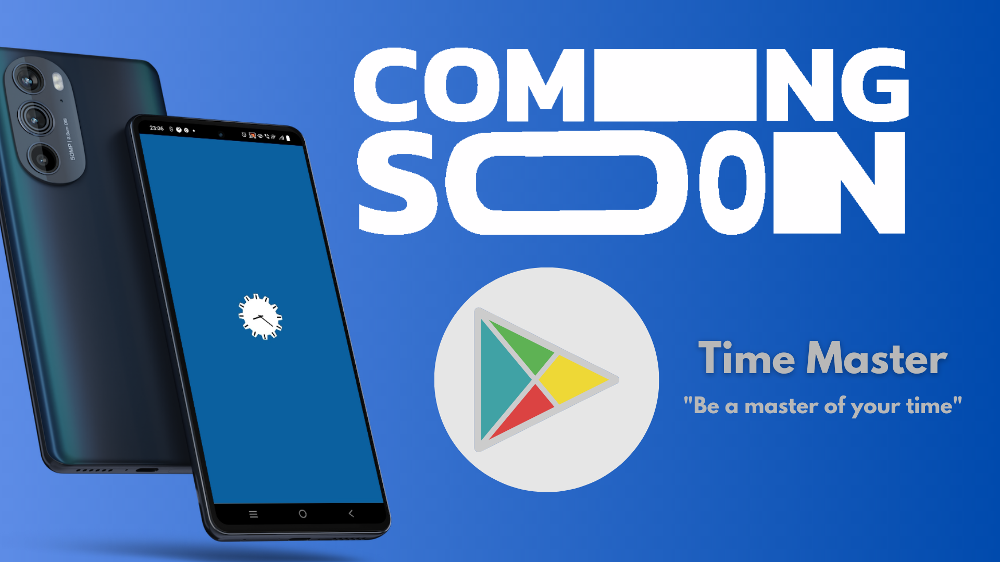

# Time Master

Time Master is a user-friendly productivity app that helps you manage your time effectively. Create custom stopwatches for different tasks, easily switch between them, and track your time investment. The app also features a to-do list, automatically saves your time data, and presents it in a graph. Stay organized, boost productivity, and gain insights into your time allocation with Time Master.

<h3> App Mockup (Youtube) </h3>

    
 

## Tech Stack
<li> React-native cli (frontend) </li>
<li> Redux (state manager) </li>
<li> Aws Amplify (Authentication,API & storage, backend) </li>

 

### Overview
Time Master is a productivity app designed to help you effectively manage your time and tasks. With Time Master, you can create custom stopwatches for different activities or tasks in your daily life. Simply start and stop the stopwatch as you switch between tasks, allowing you to accurately track the time invested in each activity.

In addition to the stopwatch feature, Time Master also includes a convenient to-do list. You can easily create and organize your tasks, ensuring that nothing falls through the cracks. The user-friendly interface makes it simple to add, edit, and mark tasks as completed.

Time Master takes care of data management for you. Your time data is automatically saved, calculating the total hours invested in each task. The app presents this information in a visually appealing graph, giving you a clear overview of your time allocation.

To ensure your data is always saved and secure, Time Master automatically stores your time entries in a database. This means that even if you close the app or the day changes, your time records are preserved.

Time Master is designed to simplify your time management process while providing valuable insights into how you spend your time. With its intuitive interface and seamless data handling, it empowers you to stay organized, increase productivity, and make the most of your valuable time.

---------

    <h3> Different Screens </h3>
  

----------
### Main Screens
There are five main screens in the project: Login/Signup, Stopwatch, Todo, Today-Table and Statistic screen.

1. Login/SignUp:
This screen is achieved by aws amplify, "amplify add auth" command, and using WithAuthenticator Higher order Component.
(Note: withauthenticator is clashing with splashscreen, need to solve this issue.)

2. Stopwatch/Card:
It is the main brain of the app, all logical stuff is embedded here, consisting of all the functionality, add activity, edit activity whole CRUD is involved here (title,timer,edit,delete). Whenever User makes changes in this screen, updated data is first mutated in redux, then mutated to database.
See Schema and data images ahead.

4. Todo:
It is a simple todo screen maintained internally via Redux state manager, also using redux persist for local storage.

5. Today-Table:
This is the simple component filtering data according to dates and displaying it to users in a form of table Task vs TotalTime.

6. Statistic Screen:
Statistic Screen is the one connecting with the cloud! Fetching,adding & mutating data and displaying it to users in forms of graph.              
-----------------
### Schema and data

  
  

--------------
### Future Roadmap

1. Need to solve issue of clash between splashscreen and withauthenticator.
2. Also planning for a Website View, using the login credentials of users in the app.
3. Need to configure ios bundle to make app run on Appstore, Iphones too.

-----------------

### Installation
<li> The App is currently available in ###
    
--------------
    
### History, How Time Master?
    
Before Creating this Project i only new Reactjs, and rest of the tech stack i learnt on the way. Let me explain in detail, So i was facing this challenge that i'm unable to track my day, my whole day would pass away and i didn't had any clue where?.

#### Idea!
So i decided, being a programmer, now this is my duty to solve this issue else i cannot call myself a programmer(xd). So after scrambling my head for weeks i finally came up with this idea, let's create an app which will consist of multiple stopwatches and I can assign the respective names/tasks to it, save the data to a data store and at night at bed could see in visual graphs, oooh there I go, this is how I'm spending my days and weeks.

#### Execution:
As Stated i already knew Reactjs so it wasn't tough for me to switch to native, while facing problems in managing data across different screens, I came to know this is a general issue and to solve it Redux was created, and I learnt it. While moving forward i got to know about this hackathon initiating users to create apps on Amplify, and here comes the entry about my easy-to-implement backend via AWS-Amplify, from then never looked back and here's my first app! @1.0.0

------------
